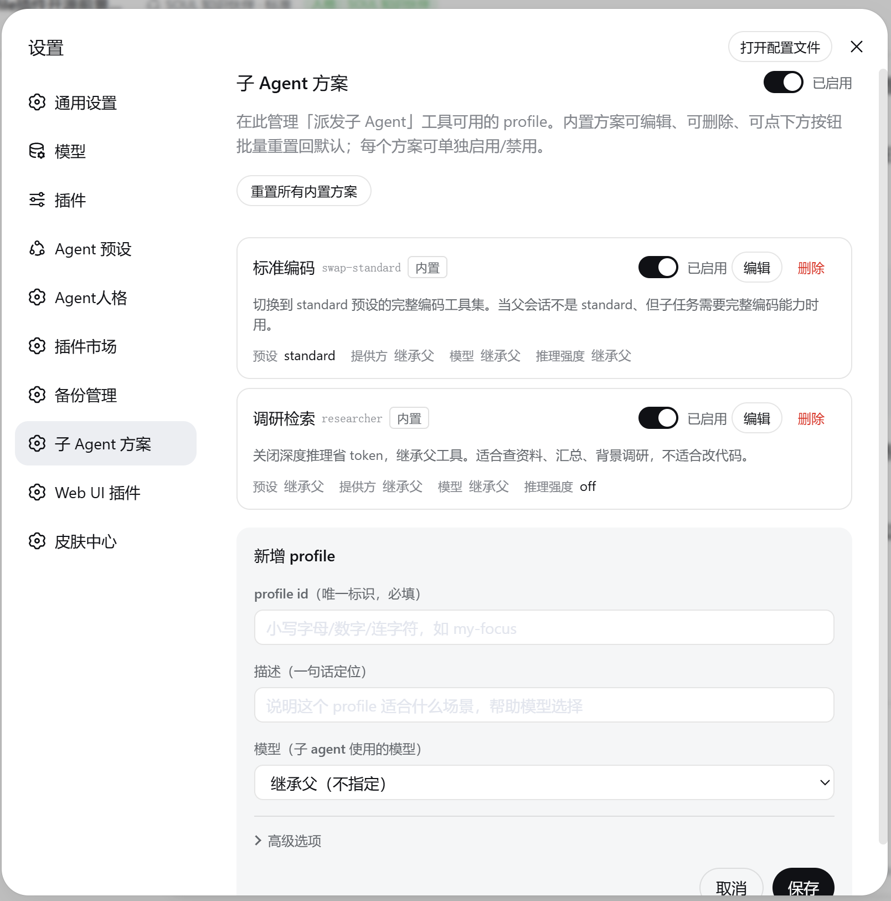
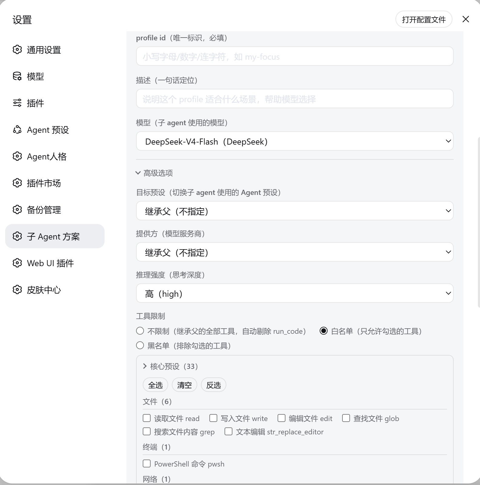
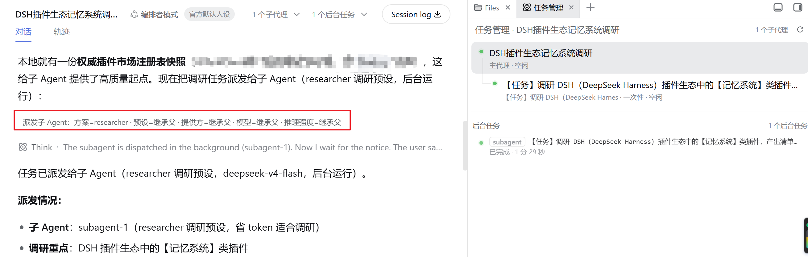

# dsh-subagent-profile

<!-- Hero -->
<div align="center">
  <b style="font-size: 1.15em;">子 Agent 派发方案化插件 —— 用对的人（预设 / 模型 / 推理强度）干对的事</b><br /><br />
  
  
  
</div>

<div align="center"><a href="README.md">English</a> · 中文</div>

为 [DeepSeek Harness](https://github.com/deepseek-ai/dsh)（DSH）打造。

> 《思考，快与慢》：系统 1 快而省，系统 2 慢而稳。内置的 `subagent` 给所有子任务同一个「大脑」，分不出快慢；`dsh-subagent-profile` 让你按任务指定——调研用快思考，攻坚用慢思考，常用搭配存成命名**方案**。

## 为什么内置 `subagent` 不够用

| | 内置 `subagent` | `dsh-subagent-profile` |
|---|---|---|
| 按子任务指定模型/预设 | ❌ 每个子任务同一个大脑 | ✅ 每个子任务单独指定 |
| 常用组合复用 | ❌ | ✅ 命名方案（profiles） |
| 收窄工具范围 | ❌ | ✅ 白名单 ∩ 父工具，`run_code` 一律移除 |
| 成本护栏 | ❌ | ✅ 模型/推理强度/token/深度上限 |
| GUI 管理 | ❌ | ✅ 设置页 |

## 解决什么问题

- **按子任务指定子 Agent 的「大脑」。** `dispatch` 给每个子任务单独指定：用哪个预设（composition）、哪个模型、哪种推理强度、只开哪些工具、给多少 token 上限。查资料和写代码两个子任务可以用完全不同的配置——这是内置 `subagent` 做不到的（它只能让子任务继承父 Agent 的同一套配置）。
- **把常用搭配存成命名方案，按名调用。** 「方案」= 预设 + 模型 + 推理强度 + 工具范围 + 人设的一揽子配置。把「调研」存成 `researcher`（关深度推理、只留检索工具），以后 `dispatch(profile="researcher")` 即可；内置 `swap-standard`（切到 standard 全套编码工具）和 `researcher` 两个现成方案，也能在设置页自己增删改。
- **每次派发都看得见实际用了什么。** 结果里标注实际生效的方案/预设/模型/推理强度，日志带 `[dsh-subagent-profile]` 标记，方便排查。

## 快速开始

```bash
dsh plugin --profile web add dsh-subagent-profile        # 发布包
dsh plugin --profile web add ./dsh-subagent-profile      # 本地检出
```

装完**重启 `dsh web`**。这是一个标准 **bundle 插件**，装好后自动提供：`dispatch` 派发工具、profile provider、`subagent-profiles` 服务、`/subagent-profiles/*` 本机管理接口，以及 Web 界面里的「子 Agent 方案」设置页与 `dispatch` 工具调用卡片。插件启动时还会**自动装好一个 agent 预设**——**`orchestrator`「编排者模式」**，在「新建会话」的预设选择器里选它即可。同步幂等、每次启动都执行，升级插件即更新预设。

## 用法

### 1. 配置子 Agent 方案

在设置页管理命名方案——每个方案打包预设 + 模型 + 推理强度 + 工具范围（可选人设），可单独启用、禁用、编辑或批量重置。





### 2. 按任务派发 —— `dispatch` 工具

```js
dispatch(
  profile: "researcher",        // 预设 + 模型 + 推理强度 + 工具范围
  prompt: "调研 DSH 插件生态，列出直接竞品并对比",
  run_in_background: true
)
```



## 方案（Profiles）

方案保存在 `~/.dsh/subagent-profiles.json`，改完立即生效（在设置页编辑）。

| 方案 | 用途 |
|---|---|
| `swap-standard` | 子 Agent 切换为 standard 全套编码工具 |
| `researcher` | 关深度推理、只留检索工具 |

## 安全模型

委派绝不会让子 Agent 拿到比你更多的权限，默认生效、无需配置：

- **工具只减不增。** 子 Agent 最终能用的工具，是「方案允许的工具」和「主 Agent 已有工具」的交集，且 `run_code`（运行代码）一律移除。
- **审批恒为「永不」。** 子 Agent 无法扩大自己的权限，需要审批的操作会被自动拒绝。
- **成本设上限。** 模型、推理强度、token、递归深度都有限制，越界直接报错、不会悄悄降级。

## 数据

- `~/.dsh/subagent-profiles.json` —— 方案注册表（由设置页编辑）。
- `~/.dsh/subagent-profiles.state.json` —— 插件的启用/禁用开关（默认启用）。
- `~/.dsh/.agent-presets/orchestrator/` —— 自动安装的 `orchestrator` 编排者预设（每次启动由打包的 `presets/orchestrator/` 同步）。

尊重 `DSH_HOME`，默认 `~/.dsh`。

## 已知限制

- **后台**一次性派发需要加载 `@deepseek-ai/dsh-jobs` 与 `@deepseek-ai/dsh-tool-jobs`，否则报「background jobs unavailable」。
- **可续跑**模式走 DSH 标准组合路径，因此 `preset` 换用与 `reasoningEffort` 会被忽略（继承父预设、使用默认推理强度）。
- **可续跑**工具门为插件侧缓解：子 Agent 的 `allow` 预加工为闭集 —— 父工具集 − `run_code` − `deny`，再与 `allow` 取交集。**假设：** 可续跑继承父预设 ⇒ 子工具集 ≈ 父工具集。**失效条件：** 任何导致子工具集与父工具集不一致的宿主行为变化（非仅换用预设——例如未来允许换用预设、组合不同工具集等），父集都可能含子集没有的工具，`tools.restrict` 会抛「未知工具」→ 本缓解自动降级为 fail-loud（保守安全）；待上游提供 provider 守卫接缝后替换为真交集。

## 目录结构

```
dsh-subagent-profile/
├── index.mjs                     # 宿主侧：插件本体（dispatch 工具、profile provider、服务、HTTP 路由）
├── lib/
│   ├── client.js                 # 浏览器侧：设置页 + dispatch 工具调用卡片
│   ├── pure.mjs                  # 无依赖纯函数（净化 / 剪枝 / 护栏计算——可单测）
│   └── shims.mjs                 # @deepseek-ai 依赖唯一入口（facade：守卫型 fail-loud、功能映射型软降级）
├── presets/orchestrator/         # 内置「编排者模式」agent 预设（自安装，每次启动同步）
├── cordis.patch.yml              # bundle 补丁：把插件行插入宿主组成
├── package.json                  # 元数据、files 发布白名单、exports
├── scripts/release.mjs           # 发布脚本（版本 bump / tag 校验）
├── docs/
│   └── screenshots/              # README 截图
├── test/                         # 宿主侧自动化测试（node:test，零新增依赖；96 用例）
│   ├── README.md / README.zh.md  # 测试目录说明（中英双语）
│   ├── harness/ctx.mjs           # 假宿主环境（fake ctx + ~/.dsh 隔离）
│   ├── characterization.test.mjs # apply() 行为快照
│   └── *.test.mjs                # pure / input-schema / persist / continuable-guard / cost-guard / gating / recycle / facade
├── README.md / README.zh.md      # 本文档（中英双语）
└── LICENSE
```

## 贡献

发现 Bug 或有新想法?欢迎[提 Issue](https://github.com/muzyLink/dsh-subagent-profile/issues)或提交 Pull Request,任何形式的贡献都欢迎。

如果这个插件帮到了你,欢迎在 GitHub 上点个 ⭐,让更多人看到它。

## 致谢

内置的 `orchestrator` 编排者预设的构成方式参考了 [dsh-liangshen（梁神模式）](https://github.com/zhu1090093659/dsh-web-ui/tree/main/packages/dsh-liangshen)（出自 [dsh-web-ui](https://github.com/zhu1090093659/dsh-web-ui)，Apache-2.0 许可）。感谢作者的出色工作。

## License

[MIT](LICENSE) — Copyright (c) 2026 muzyLink
